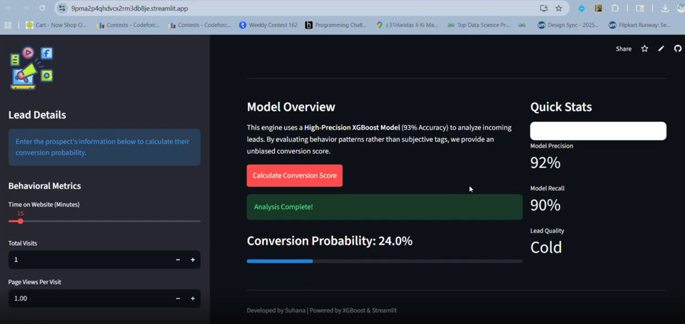

# 🎯 LeadRadar: AI-Driven Lead Scoring Engine

A high-precision Machine Learning solution designed to identify high-value prospects for B2B sales teams. By analyzing behavioral metadata, this project helps businesses prioritize leads that are most likely to convert, reducing sales fatigue and increasing ROI.

## 🚀 Project Overview
In a typical sales funnel, 60-70% of leads never convert. This project solves the "Cold Lead" problem by using **XGBoost** to rank prospects based on website engagement, lead origin, and professional profile.

### ✨ Key Results
* **Accuracy:** 93%
* **Precision:** 92% (Minimizes false positives/wasted sales calls)
* **Recall:** 90% (Ensures high-value leads are not missed)
* **Winning Model:** XGBoost (Optimized via Hyperparameter Tuning)

## 🛠️ Technical Stack
* **Language:** Python 3.x
* **ML Frameworks:** Scikit-Learn, XGBoost
* **Dashboard:** Streamlit
* **Visualization:** Plotly, Seaborn, Matplotlib
* **Deployment:** Pickle (Model Serialization)

## 📂 Project Structure
```text
├── data/               # Raw and processed datasets
├── models/             # Pickled model and scaler files
├── notebooks/          # Exploratory Data Analysis (EDA) & Model Training
├── app.py              # Streamlit Dashboard code
├── requirements.txt    # Project dependencies
└── README.md           # Documentation

## 🎥 Project Demo


[](https://drive.google.com/file/d/1XMufYTvDGvNNlz4u1Hrdle1cWL-jWpCs/view?usp=sharing)